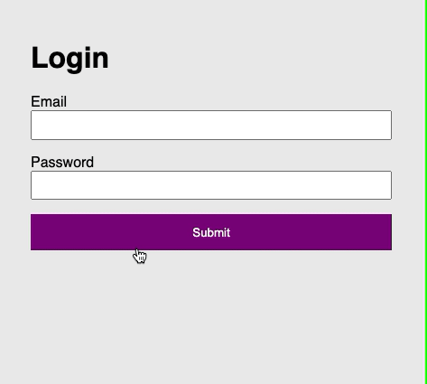

# JavaScript 2 MA 3

## Brief

Create a login form that, once validation has passed, makes a POST request to the following URL:

```
https://b6xh3nykt5.execute-api.eu-west-2.amazonaws.com/default/loginMock
```

The login form should have an `email` and a `password` input. The API endpoint expects two keys and values to be sent:

```js
{
    "email": theEmailvalue,
    "password": thePasswordvalue
}
```

Sending the value `admin@example.com` for `email` and `Password123` for `password` will return a 200 status code and a successful message.

Any other values will return a 401 status and an unsuccessful message.

Create appropriate UI for both cases.

## Example


